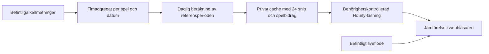

# Hourly: datakontroll och förslag

Implementationen använder nu ett fast urval med 24 spel och återanvänder äldre historik som en tydligt märkt historisk referens. Se [drift och kvalitetsregler](hourly-operations.md) för det aktuella beteendet; texten nedan bevarar det ursprungliga designunderlaget och dess dåvarande datakontroll.

Underlag för en timvy för Premium och Founders, baserat på kod och en läsande kontroll av den konfigurerade Redis-databasen den 6 september 2026, cirka 10:14 svensk tid. Detta är ett designförslag; applikationen och produktionsdata har inte ändrats.

## Rekommendation

Bygg en historisk dygnskurva med 24 timsnitt och en vågrät referenslinje för aktuellt spelarantal. Markera nuvarande timme, men låt användaren välja vilken timme som helst för att se skillnaden i antal och procent. Referenslinjen visar samma ögonblicksvärde över hela diagrammet; den ska inte kunna förväxlas med dagens uppmätta utveckling.

Använd åtta avslutade veckor som standardperiod. Det ger bättre täckning än fyra veckor i det underlag som finns nu. Visa det faktiska antalet giltiga dagar för varje timme. Periodens längd är inte ett löfte om lika många observerade dagar. Ett alternativ för fyra veckor kan tillkomma när täckningen är bättre; filtrering på veckodag bör vänta tills den ger tillräckligt många observationer.

## Vad som finns idag

| Kontrollerat underlag | Resultat |
| --- | --- |
| Tidsstämplade serier för 37 konfigurerade spel | 175 618 sparade poster före rensning av dubbletter och datakvalitetskontroll |
| Många äldre spelserier | 5 000 poster per spel; äldsta kvarvarande poster från 10–17 juli |
| Fyra separata Unibet-serier | Historik från 5 augusti |
| Serien `cs:lobby-total:v1:samples` | 40 poster från 1–6 september |
| Sparad Hourly-baslinje | 10 använda poster, 5 dagar och 0 färdiga timmar |
| Crazy Time, 1–5 september | 11, 7, 7, 7 respektive 9 unika tidsstämplar per dag |
| Senaste sparade huvudlobby vid kontrollen | 6 september 06:39 svensk tid; materialiserad 06:41 |

Hourly läser den nya totalserien och väljer den vanligaste exakta speluppsättningen. Andra uppsättningar och äldre poster utan signatur faller bort. De äldre spelserierna används inte för denna vy. Detta förklarar varför bilden visar tio mätningar trots att databasen innehåller mycket mer historik.

En preliminär täckningskontroll av 32 huvudspel, utan Craps och de fyra senare Unibet-spelen, hittade underlag i alla 24 timmar över 56 avslutade dagar: 8–28 dagar per timme. Kontrollen krävde gemensamma exakta tidsstämplar, räknade högst en observation per tiominutersintervall och minst två intervall per dag och timme. Över 28 dagar klarade bara 22 timmar minst tre dagar. Detta är en täckningskontroll, inte färdig kvalitetssäkrad spelarstatistik; misstänkt frysta värden har ännu inte rensats i denna jämförelse.

Långa serier med dagssnitt kan inte återskapa förlorade timvärden. Äldre säkerhetskopior kan komplettera ett arkiv, men ska inte blandas in i ett aktuellt åttaveckorssnitt om de ligger utanför perioden.

## Beräkning och jämförbarhet

1. Återanvänd tidsstämplade spelmätningar i en engångskörning. Välj uttryckligen spel-ID:n; summera inte alla `cs:*:samples`, eftersom det även kan inkludera en redan summerad lobbyserie och inaktiva spel.
2. Validera tidsstämpel och spelarantal. Rensa dubbletter per spel och källtidsstämpel. Saknade, gamla eller felaktiga värden ska inte bli noll. Ett verifierat nollvärde ska däremot kunna räknas med. Upprepade identiska värden är en kvalitetssignal, inte ensamma ett bevis på fel.
3. Samordna mätningar i UTC-intervall om tio minuter. Spara ursprunglig källtidsstämpel och hur stor del av timmen som faktiskt observerats. Fyll inte längre luckor med senaste kända värde. Källor som uppdaterar vid olika tidpunkter måste hanteras med en uttrycklig gräns för ålder och tidsskillnad.
4. Räkna ett aritmetiskt medel per avslutad dag och timme från giltiga intervall. Kräv observationer som täcker en meningsfull del av timmen; tröskeln ska utvärderas mot verkliga luckor. Ta därefter medelvärdet av dagsvärdena så varje giltig dag väger lika. Byt inte omärkligt från medelvärde till median, vilket nuvarande `robustAverage` kan göra.
5. Spara per spel så att jämförelsens spelurval kan hanteras uttryckligt. Använd ett versionsmärkt grundurval med tillräcklig historik för hela dygnskurvan. För varje timme ska grundurvalets bidrag bygga på samma giltiga historiska dagar. Nya spel tas in när underlaget räcker; de ska inte återställa äldre historik.
6. Live och historik ska omfatta samma spel i hela diagrammet. Vid ett tillfälligt bortfall kan samma spel tas bort från både live och samtliga 24 historiska snitt med de förberäknade spelbidragen. Visa att urvalet är begränsat och hur mycket av den historiska spelarvolymen det normalt täcker. Om ett betydande spel saknas, pausa livejämförelsen men behåll den historiska kurvan. Presentera inte en delsumma som hela lobbyn.
7. Gruppera visningen enligt `Europe/Stockholm`. Exkludera dagens ofärdiga timmar från referensperioden. Testa båda övergångarna för sommartid: en saknad timme får inget påhittat värde och en upprepad timme får inte ge dagen dubbel vikt.

Första versionen behöver medelvärde, observationsdagar och täckning per timme. Ett variationsband kan läggas till senare från historiska dagsvärden för samma spelurval. Summera inte separata spels percentiler och kalla resultatet lobbyns variationsband.

## Sidan

- Överst: jämförbart liveantal, snitt för vald timme och skillnad i antal/procent. Nuvarande timme är förvald.
- Diagram: 00–23, historiskt timsnitt, en tydligt märkt referenslinje för live och markering av vald respektive aktuell timme.
- Val med mus, pekskärm och tangentbord uppdaterar jämförelsen lokalt.
- Vid vald timme: antal giltiga dagar, period och vilka spel som omfattas. Formulera det som spelarantal i de bevakade spelen; datan visar inte verifierat unika personer i hela Evolution.
- Saknas historik för en timme, visa en lucka för den timmen och behåll resten. Visa begränsat underlag där observationerna är få, utan en nedräkning som förutsätter obruten framtida insamling.
- Är livedata gammal, visa senaste mättid och pausa procentjämförelsen. Historiken ska fortfarande gå att använda. Historikens beräkningstid och livevärdets mättid är olika uppgifter.

## Lagring och kostnad

Behåll den befintliga insamlingen och den serverkontrollerade åtkomsten. Den privata Hourly-routen läser redan en färdig baslinje; principen är bra. Förändringen gäller vilket underlag baslinjen byggs av och hur livedata återanvänds.

- Gör historisk återfyllning en gång, lokalt eller i en separat bakgrundskörning. Undvik att läsa alla råserier vid sidbesök.
- Uppdatera timaggregat inkrementellt när nya mätningar sparas. Gör uppdateringen atomär och idempotent så omkörningar och överlappande jobb inte dubbelräknas. Hantera sena observationer innan en dag låses.
- Behåll kompakta timaggregat minst hela referensperioden plus marginal. Exempelvis motsvarar 37 spel × 24 timmar × 90 dagar högst 79 920 spel/timposter före metadata; gruppera dem praktiskt per datum eller UTC-timme för att undvika onödigt många Redis-nycklar och anrop.
- Materialisera referenskurvan dagligen efter avslutat Stockholmsdygn. Lagra även versionsnummer, giltiga periodgränser, beräkningstid och observationsmetadata. Behåll senast fungerande resultat vid ett misslyckat jobb och visa dess ålder.
- Läs referenskurvan när Hourly öppnas och återanvänd den inom samma behöriga session. Återanvänd sidans gemensamma liveflöde. Byte av vald timme och uppdaterade livedeltan behöver inga egna serveranrop. Rensa användarcachen vid utloggning eller byte av konto.
- Kontrollera Premium/Founder-behörighet på servern. Lägg inte premiuminnehållet i en offentlig JSON-fil eller en allmänt delad HTTP-cache för att spara kostnad. En intern datacache kan delas bakom åtkomstkontrollen.

Detta ger låg extra belastning, men inte garanterat noll kostnad. Vercel Functions debiterar enligt plan och användning av CPU, minne och anrop. Att GitHub startar ett jobb som anropar en Vercel-route flyttar inte själva exekveringen från Vercel. Upstash har separata kostnader och gränser för databasens plan. Exakt månadspris kräver faktisk trafik, region, plan och mätning av körningstid och datamängd.

Som storleksordning ger en daglig materialisering cirka 30 körningar per månad, jämfört med cirka 720 om referensen räknas om varje timme. Det är referenskurvans uppdateringar, inte antalet liveinsamlingar eller alla anrop till webbplatsen. Den befintliga huvudcron-routen läser dessutom upp till hela den behållna historiken för alla spel för att upptäcka frysta värden. Den läsningen bör granskas separat när den glesa insamlingen utreds; ett avgränsat tillstånd för senaste värde och identisk följd kan minska arbetet.

Källor: [Vercel Functions-prissättning](https://vercel.com/docs/functions/usage-and-pricing), [Upstash Redis-prissättning](https://upstash.com/pricing/redis), kontrollerade 6 september 2026.

## Genomförande och verifiering

1. Fastställ varför huvudkällan ger så få nya mätningar: schemakörningar, route-resultat, färska källtidsstämplar, överhoppade körningar och lyckade lagringar. Kontrollera att den konfigurerade databasen är samma som den avsedda produktionsmiljön. Gles historik bevisar inte ensam vilken del som felar.
2. Bygg en ren aggregeringsmodul med injicerad tid, utan databasberoenden. Kör återfyllning som dry-run och granska per timme/dag/spel innan resultat sparas under en ny version.
3. Lägg till inkrementell lagring och bakgrundsmaterialisering, med tydliga felresultat och förra fungerande baslinjen som reserv. Den privata läsrouten får inte falla tillbaka till en dyr råhistorikläsning.
4. Bygg om Hourly till den valbara timjämförelsen och bind den till befintligt liveflöde. Aktuell timme och ålderskontroll måste fortsätta uppdateras även när sidan står öppen.
5. Testa dubbletter, olika samplingsfrekvens, verkliga nollor, saknade/frysta/gamla värden, framtida tider, sommartid, nya och bortfallna spel, otillräcklig täckning samt delvis misslyckad materialisering. Verifiera återfyllning och inkrementell uppdatering mot samma handräknade exempel. Testa obehörig åtkomst och cacheåterställning vid kontobyte.
6. Kontrollera diagram och timval på mobil och med tangentbord. Verifiera att timval och liveuppdateringar inte startar extra Hourly-anrop. Mät råhistorikläsningar, Redis-kommandon, svarsstorlek och funktionstid före och efter.

Avvägningen är mer arbete i engångsåterfyllningen och tydligare kvalitetsregler, mot små och förutsägbara läsningar i den dagliga användningen. Äldre rådata saknar fullständig historisk kvalitetsmetadata, så all befintlig historik kan inte utan vidare certifieras som tillförlitlig.
